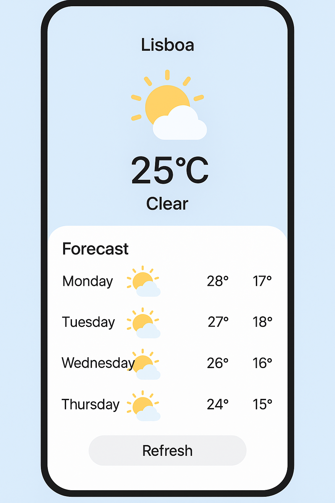

# Weather App - Jetpack Compose
A simple Android weather app built with **Kotlin** and **Jetpack Compose**.

## Features
- Display of current location and weather
- Forecast for the next 4 days
- Clean, modern UI with Jetpack Compose
- Refresh button to manually update the weather

## Tech Stack
- [Kotlin](https://kotlinlang.org/)
- [Jetpack Compose](https://developer.android.com/jetpack/compose)
- [Material3](https://m3.material.io/)
- [OpenWeatherMap API](https://openweathermap.org/api) (coming soon)

## Screenshots
<p align="center">
  
</p>

## Getting Started
1. Clone the repository:
```bash
git clone https://github.com/ritasmarques/weather-app-compose.git
```
2. Open in Android Studio
3. Run the project using an emulator or real device

## Design
Initial mockup created with AI (based on soft blue gradients + clean font)

## Author
Rita Sousa Marques  
[GitHub](https://github.com/ritasmarques) | [LinkedIn](https://www.linkedin.com/in/rita-de-sousa-marques/)

## Contact
Feel free to reach out if you want to collaborate or share feedback!
